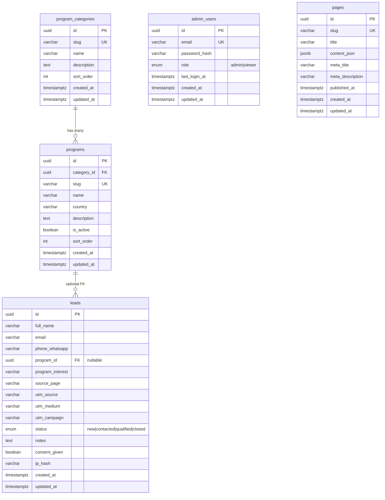
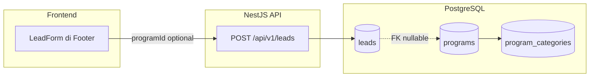

# ERD — IDEA Institut Database

Database: **PostgreSQL 16**  
ORM: **Prisma** (`apps/api/prisma/schema.prisma`)

---

## Diagram Relasi (ERD)

---

## Relasi Antar Entitas

| Relasi | Kardinalitas | Keterangan |
|--------|--------------|------------|
| `program_categories` → `programs` | **1 : N** | Satu kategori (Language / Vocational / Study & Work) punya banyak program |
| `programs` → `leads` | **1 : N** (opsional) | Lead bisa pilih program spesifik via `program_id`; boleh kosong jika hanya isi `program_interest` teks |
| `admin_users` | **Standalone** | Tidak berelasi ke tabel lain; dipakai untuk auth dashboard admin |
| `pages` | **Standalone** | Konten halaman CMS (sub-halaman study-work, dll.); tidak FK ke entitas lain |

---

## Enum

### `LeadStatus` (kolom `leads.status`)

| Nilai | Arti |
|-------|------|
| `new` | Lead baru masuk (default) |
| `contacted` | Sudah dihubungi tim sales |
| `qualified` | Prospek qualified |
| `closed` | Selesai (deal / tidak lanjut) |

### `AdminRole` (kolom `admin_users.role`)

| Nilai | Arti |
|-------|------|
| `admin` | Full access CRUD leads, programs, pages |
| `viewer` | Read-only (reserved untuk fase berikutnya) |

---

## Detail Tabel

### `program_categories`

Kategori menu utama (sesuai navigasi website).

| Kolom | Tipe | Constraint | Contoh seed |
|-------|------|------------|-------------|
| `id` | UUID | PK | auto |
| `slug` | VARCHAR | UNIQUE | `language-course` |
| `name` | VARCHAR | NOT NULL | `Language Course` |
| `description` | TEXT | nullable | Kursus persiapan bahasa |
| `sort_order` | INT | default 0 | 1, 2, 3 |

**Seed:** `language-course`, `vocational-course`, `study-work-program`

---

### `programs`

Program individual untuk dropdown lead form & katalog.

| Kolom | Tipe | Constraint | Contoh |
|-------|------|------------|--------|
| `id` | UUID | PK | auto |
| `category_id` | UUID | FK → `program_categories.id` | — |
| `slug` | VARCHAR | UNIQUE | `english`, `germany` |
| `name` | VARCHAR | NOT NULL | `English` |
| `country` | VARCHAR | nullable | `DE`, `AU` |
| `description` | TEXT | nullable | — |
| `is_active` | BOOLEAN | default true | — |
| `sort_order` | INT | default 0 | — |

**Relasi:** `ON DELETE RESTRICT` — kategori tidak bisa dihapus jika masih punya program.

---

### `leads`

Data intake utama dari form `#contact-info`.

| Kolom | Tipe | Constraint | Keterangan |
|-------|------|------------|------------|
| `id` | UUID | PK | — |
| `full_name` | VARCHAR | NOT NULL | Nama lengkap |
| `email` | VARCHAR | NOT NULL | Email |
| `phone_whatsapp` | VARCHAR | NOT NULL | Nomor WhatsApp |
| `program_id` | UUID | FK nullable → `programs.id` | Pilihan dari dropdown |
| `program_interest` | VARCHAR | nullable | Fallback teks jika program_id kosong |
| `source_page` | VARCHAR | nullable | Halaman asal submit (e.g. `/`) |
| `utm_source` | VARCHAR | nullable | Tracking marketing |
| `utm_medium` | VARCHAR | nullable | Tracking marketing |
| `utm_campaign` | VARCHAR | nullable | Tracking marketing |
| `status` | ENUM | default `new` | Pipeline sales |
| `notes` | TEXT | nullable | Catatan admin |
| `consent_given` | BOOLEAN | default false | Persetujuan UU PDP |
| `ip_hash` | VARCHAR | nullable | SHA-256 hash IP (audit) |

**Relasi:** `ON DELETE SET NULL` — jika program dihapus, lead tetap ada tanpa FK.

---

### `admin_users`

Akun untuk dashboard admin (`/admin`).

| Kolom | Tipe | Constraint |
|-------|------|------------|
| `id` | UUID | PK |
| `email` | VARCHAR | UNIQUE, NOT NULL |
| `password_hash` | VARCHAR | NOT NULL (bcrypt) |
| `role` | ENUM | default `admin` |
| `last_login_at` | TIMESTAMPTZ | nullable |

---

### `pages`

Konten halaman dinamis (CMS) — sub-halaman study-work, dll.

| Kolom | Tipe | Constraint |
|-------|------|------------|
| `id` | UUID | PK |
| `slug` | VARCHAR | UNIQUE |
| `title` | VARCHAR | NOT NULL |
| `content_json` | JSONB | NOT NULL |
| `meta_title` | VARCHAR | nullable (SEO) |
| `meta_description` | VARCHAR | nullable (SEO) |
| `published_at` | TIMESTAMPTZ | nullable |

**Seed slugs:** `studi-keluar-negeri`, `studi-sambil-kerja`, `kuliah-di-australia`, `kuliah-di-german`

---

## Alur Data Lead Form

---

## File Terkait

- Schema Prisma: [`apps/api/prisma/schema.prisma`](../apps/api/prisma/schema.prisma)
- Migration SQL: [`apps/api/prisma/migrations/1735689600000_init/migration.sql`](../apps/api/prisma/migrations/1735689600000_init/migration.sql)
- Seed data: [`apps/api/prisma/seed.ts`](../apps/api/prisma/seed.ts)
